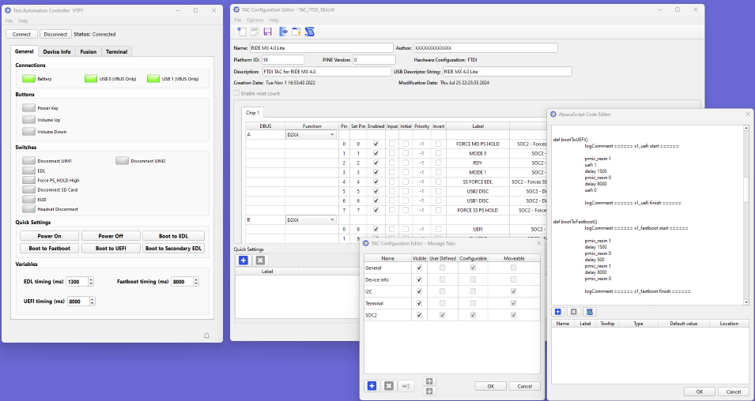
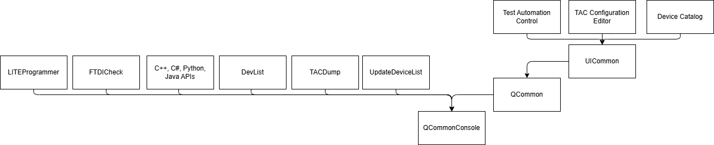
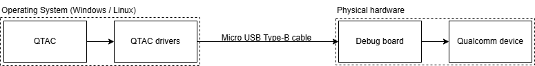

# Qualcomm Test Automation Controller (QTAC)

## Introduction

QTAC is a software suite that enables users to control Qualcomm devices remotely.
The device to be controlled must be attached to a Qualcomm approved debug board. The device to be tested, is
connected to a host using a USB cable.



## Download pre-built binaries

Download the QTAC release from the [releases](https://github.com/qualcomm/qcom-test-automation-controller/releases)

## Build from source

Please review the following guide to build the project from source. For one time setup instructions to build from
source, please review [software install guide](#software-install-guide)

### Clone repository

Use the below command to clone the project source:

```bash
git clone https://github.com/qualcomm/qcom-test-automation-controller.git
```

### Compile QTAC for Windows

Execute the [build.bat](./build.bat) to generate the executables on Windows.
- Debug build will be available at `__Builds/x64/Debug`
- Release build will be available at `__Builds/x64/Release`

### Compile QTAC for Linux

Execute the [build.sh](./build.sh) to generate the executables on Linux.
- Debug build will be available at `__Builds/x64/Debug`
- Release build will be available at `__Builds/x64/Release`

> [!NOTE]
> QTAC uses FTDI libraries to control FT4232H chip on the debug board. Find out more about the FTDI D2XX libraries
[here](https://ftdichip.com/drivers/d2xx-drivers/). FTDI libraries are installed _automatically_ during the cmake configuration step.

> [!NOTE]
> Installation using Qt Online Installer will require users to create a Qt account. To get started quickly on Linux, users can execute below bash commands on Linux.
> Below method updates setup packages and may impact other applications.
> `sudo apt install qt6-base-dev qt6-serialport-dev`

## Software install guide

### Install tools for development

| Category | Software | Minimum version
| :-- | :-- | :-- |
| Operating System | Windows, Debian | Windows 10 & above<br>Ubuntu 22.04 & above |
| Software development | [Visual Studio Compiler 2022](https://visualstudio.microsoft.com/downloads/#build-tools-for-visual-studio-2022) (Windows)<br>GCC (Linux) |  MSVC 2022 (Windows)<br>GCC-11, G++-11, GLIBC-2.35 (Linux) |
| Software development | [Qt Open-source](https://www.qt.io/download-qt-installer-oss) | 6.9.0 and above. Download and execute `./qt-online-installer-linux-x64-4.10.0.run` from bash on Linux |

Please review the usage policies, license terms, and conditions of the above software before use.

### Configure Qt installation

QTAC requires Qt 6.9+ and MSVC 2022 64-bit. Choose below additional dependencies during Qt installation:
1. Qt Serial Port

If Qt is already installed, run the [Qt Maintenance tool](https://doc.qt.io/qt-6/get-and-install-qt.html#using-qt-maintenance-tool)
to install additional dependencies.

### Configure environment

With the development tools installed on your system, please set up the following environment variables:

- `QTBIN`: `C:\Qt\<version>\msvc2022_64\bin`

**On Windows**:

```cmd
setx QTBIN C:\Qt\<version>\msvc2022_64\bin
```

**On Linux**:

Start a bash terminal at the project root and ensure [make](https://www.gnu.org/software/make/) is available in the environment.
Then, execute the below commands. If you're frequently working with Qt, consider adding below path to `.bashrc`.

```bash
export QTBIN=/path/to/Qt/directory/<version>/gcc_64/bin
```

**Linux dependencies**:

Following packages are required on Linux to execute QTAC applications.
| Name | Library | Notes | Configuration options | Install command |
| ---- | ----| ---- | ---- | ---- |
| xcb-cursor0 | libxcb-cursor0 | Utility library for XCB for cursor | auto-detected | `sudo apt install -y libxcb-cursor0` |
| libpcre2-16-0 | libpcre2-16-0 | New perl compatible regular expression library | auto-detected | `sudo apt install -y libpcre2-16-0` |
| libxkbcommon-x11 | libxkbcommon-x11-0 | Library to create keymaps with the XKB X11 protocol | auto-detected | `sudo apt install -y libxkbcommon-x11-0` |
| libxcb-xkb | libxcb-xkb1 | X C Binding, XKEYBOARD extension | auto-detected | `sudo apt install -y libxcb-xkb1` |
| libxcb-icccm | libxcb-icccm4 | Utility libraries for X C Binding -- icccm | auto-detected | `sudo apt install -y libxcb-icccm4` |
| libxcb-shape0 | libxcb-shape0 | The shape extension for the X C Binding | auto-detected | `sudo apt -y install libxcb-shape0` |
| libxcb-keysyms | libxcb-keysyms1 | Utility libraries for X C Binding -- keysyms | auto-detected | `sudo apt install -y libxcb-keysyms1` |
| libgl1 | libgl1 | Vendor neutral GL dispatch library -- legacy GL support | auto-detected | `sudo apt -y install libgl1` |
| libegl-dev | libegl-dev | Vendor-neutral dispatch layer for arbitrating OpenGL API | auto-detected | `sudo apt -y install libegl-dev` |
| libxcb-xinerama0 | libxcb-xinerama0 | The xinerama extension for the X C Binding | auto-detected | `sudo apt-get install --reinstall libxcb-xinerama0` |

## Repository structure

QTAC repository has the following sub-directories:

1. `.github`: GitHub CI/CD build pipelines
2. `configurations`: Platform specific pin configurations to control devices
3. `docs`: API documentation and guide
4. `examples`: Example scripts to demonstrate the use of device-control automation APIs
5. `interfaces`: Device control APIs for C++, Python, C# and Java
6. `src`: Source files containing core libraries, CLI and UI applications
   - `applications`: CLI and UI applications
   - `libraries`: Core libraries referenced by other libraries, CLI & UI applications
7. `third-party`: Contains automation scripts to install external project dependencies

## Application dependency architecture

Applications and library in QTAC has the following overall dependency architecture


**Brief description on the tools generated by QTAC**:

1. **Test Automation Controller (TAC)**: Control Qualcomm devices remotely using UI
2. **TAC Configuration Editor**: Design configurable TAC UI based on GPIO use-cases to be used by TAC for device control
3. **Device Catalog**: Program debug board and view list of supported Qualcomm platforms
4. **TACDump**: Command line utility to list connected debug boards (aka. TAC devices)
5. **DevList**: Command line utility to view list of supported Qualcomm platforms
6. **FTDICheck**: Windows utility to auto install required FTDI drivers
7. **LITEProgrammer**: Command line utility to program FTDI debug boards
8. **UpdateDeviceList**: Command line utility to update the catalog of supported platforms used by TAC. Run this application if you're creating a new configuration using **TAC Configuration Editor**.

Other generated files may include libraries, example applications.

## Qualcomm device control using QTAC

### Hardware setup

QTAC requires you to have physical access to Qualcomm approved devices and debug boards. QTAC is device-agnostic
and supports all Qualcomm chipsets and form-factors.

The Qualcomm device may be attached directly to the debug board or through cable strip depending on the
form-factor or the guidelines outlined in the hardware manual.

If you've questions, suggestions or issues with setup, please do reach out to us on
[discord](https://discord.com/invite/qualcommdevelopernetwork).

You will have to install the [required drivers](#install-drivers) correctly. The one-time driver installation
step is taken care if you install a release package.



### Install drivers

The one-time driver installation step is taken care if you install a release package. If you choose
to [build from source](#build-from-source), configure below drivers:

1. [FTDI D2XX drivers](https://ftdichip.com/drivers/d2xx-drivers/): to interact with the debug board
2. [Qualcomm USB Drivers](https://softwarecenter.qualcomm.com/catalog/item/QUD): to view device
   status (Emergency Download Mode, USB Diagonistics Mode, etc)

### Optional software

QTAC allows you to view the streaming device logs as you transition the device between different
states. The debug logs are streamed over USB serial interface(s).

To view these logs, you may install [Putty](https://www.putty.org/) or a similar software. QTAC
does not depend or use this software.

## Bug & Vulnerability reporting

Please review the [SECURITY.md](./.github/SECURITY.md) before reporting vulnerabilities with the project

## Contributor's License Agreement

Please review the Qualcomm product [license](./LICENSE), [code of conduct](./CODE-OF-CONDUCT.md) & terms
and conditions before contributing.

## Using Qt Creator for development

If you're interested in compiling the project using Qt Creator, please refer the
[01-Build-Using-Qt-Creator](./docs/getting-started/01-Build-Using-Qt-Creator.md) guide.
