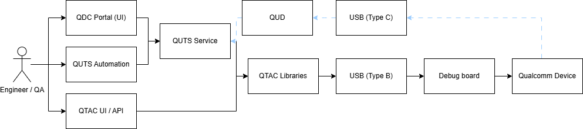
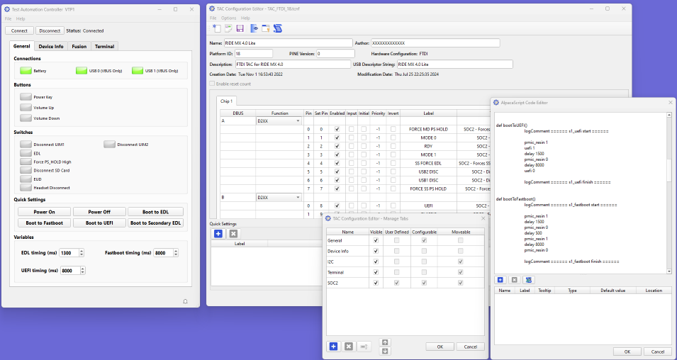
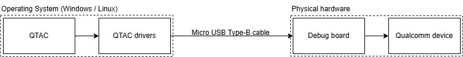
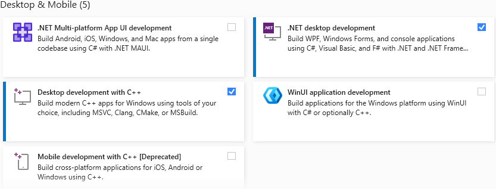
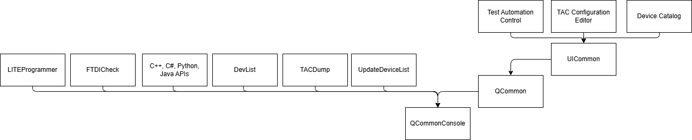

# Qualcomm Test Automation Controller (QTAC)

## Introduction

QTAC is a software suite that enables users to control Qualcomm devices remotely. The device to be controlled must be attached to a Qualcomm approved debug board and connected to a host using a USB cable.

### Workflow Overview



QTAC is widely used within Qualcomm to control Qualcomm devices according to the following workflow:

1. Engineers create and trigger [Qualcomm Device Cloud (QDC)](https://qdc.qualcomm.com) jobs on Qualcomm platforms
2. QDC jobs perform power measurements and device flashing by transitioning devices between states (power off/on, emergency download mode)
3. Engineers use QTAC via QUTS APIs or standalone QTAC UI/API based on team requirements
4. QDC and QUTS automation dispatch commands through the QUTS Service layer to QTAC libraries
5. QTAC UI and API send commands directly to QTAC libraries, bypassing the QUTS Service layer
6. QTAC libraries control debug boards to update device states
7. Device state changes are notified to the OS via Qualcomm USB Drivers (QUD) through a separate USB endpoint
8. Blue dotted lines in the diagram show device state notifications to the host OS (outside QTAC scope)

### What You Get

A successful compilation of the project will yield the following applications:

1. **Test Automation Controller (TAC)**: Control Qualcomm devices remotely using UI
2. **TAC Configuration Editor**: Design configurable TAC UI based on GPIO use-cases
3. **Device Catalog**: Program debug board and view list of supported Qualcomm platforms
4. **Command-line utilities**: TACDump, DevList, FTDICheck, LITEProgrammer, UpdateDeviceList



*Left: QTAC Connected Device UI | Right: QTAC Configuration Editor*

## Hardware Requirements

### Required Hardware

QTAC requires physical access to:
1. **Qualcomm approved debug board** (e.g., FTDI-based or PSOC-based boards)
2. **Qualcomm device** to be controlled (any chipset or form-factor)
3. **USB cables**:
   - Type B Micro-USB cable (debug board to host)
   - Type-C USB cable (Qualcomm device to host)

### Hardware Setup

The Qualcomm device may be attached directly to the debug board or through a cable strip depending on the form-factor or guidelines outlined in the hardware manual.



If you have questions, suggestions, or issues with setup, please reach out to us using [GitHub issues](https://github.com/qualcomm/qcom-test-automation-controller/issues).

### Install Drivers

QTAC requires the following drivers to be installed on your host system:

1. **[FTDI D2XX drivers](https://ftdichip.com/drivers/d2xx-drivers/)**: To interact with the debug board
2. **[Qualcomm USB Drivers (QUD)](https://softwarecenter.qualcomm.com/catalog/item/QUD)**: To view device status (Emergency Download Mode, USB Diagnostics Mode, etc.)

> [!NOTE]
> FTDI libraries are installed _automatically_ during the cmake configuration step when building from source.

### Optional Software

QTAC allows you to view streaming device logs as you transition the device between different states. The debug logs are streamed over USB serial interface(s).

To view these logs, you may install [Putty](https://www.putty.org/) or similar terminal software. QTAC does not depend on or use this software.

## Software Prerequisites

### Install Development Tools

| Category | Software | Minimum Version |
| :-- | :-- | :-- |
| Operating System | Windows, Debian | Windows 10 & above<br>Ubuntu 22.04 & above |
| Compiler | [Download MSVC 2022 (Windows)](https://aka.ms/vs/17/release/vs_community.exe)<br>GCC (Linux) | MSVC 2022 (Windows)<br>GCC-11, G++-11, GLIBC-2.35 (Linux) |
| UI Framework | [Qt Open-source](https://www.qt.io/download-qt-installer-oss) | 6.9.0 and above |

> [!NOTE]
> Before use, please review the license terms for [Microsoft Visual Studio](https://visualstudio.microsoft.com/license-terms/) and [Qt](https://www.qt.io/development/download-open-source). We provide a direct link to MSVC 2022 because the current Qt version does not yet support the latest MSVC 2026 compiler available on Microsoft's website. This will be updated when Qt adds support for MSVC 2026.

### Configure Visual Studio Compiler 2022 on Windows

When building the project on Windows, please choose the following dependencies from the Visual Studio Installer.

1. **Desktop development with C++** required for project compilation
2. **.NET desktop development** required to compile QTAC C# APIs



### Configure Qt Installation

QTAC requires Qt 6.9+ and MSVC 2022 64-bit (Windows) or GCC (Linux). Choose the following additional dependencies during Qt installation:
- Qt Serial Port

If Qt is already installed, run the [Qt Maintenance tool](https://doc.qt.io/qt-6/get-and-install-qt.html#using-qt-maintenance-tool) to install additional dependencies.

**Quick Qt Installation on Linux**:

```bash
sudo apt install qt6-base-dev qt6-serialport-dev
```

> [!NOTE]
> Installation using Qt Online Installer will require users to create a Qt account.

### Linux Runtime Dependencies

The following packages are required on Linux to execute QTAC applications:

```bash
sudo apt install -y libxcb-cursor0 libpcre2-16-0 libxkbcommon-x11-0 libxcb-xkb1 libxcb-icccm4 libxcb-shape0 libxcb-keysyms1 libgl1 libegl-dev libxcb-xinerama0 libpulse-dev
```

> [!WARNING]
> Installing packages using `sudo apt install ...` will update packages globally in your system. Please review commands carefully before executing to prevent issues with other installed applications.

### Configure Environment Variables

Set up the following environment variable to point to your Qt installation:

**On Windows**:

```cmd
setx QTBIN C:\Qt\<version>\msvc2022_64\bin
```

**On Linux**:

```bash
export QTBIN=/path/to/Qt/directory/<version>/gcc_64/bin
```

> [!TIP]
> If you're frequently working with Qt on Linux, consider adding the above path to `.bashrc`.

## Build from Source

### Clone Repository

```bash
git clone https://github.com/qualcomm/qcom-test-automation-controller.git
```

### Compile QTAC for Windows

Execute the [build.bat](./build.bat) to generate the executables:

```cmd
build.bat
```

Build output:
- Debug build: `__Builds/x64/Debug`
- Release build: `__Builds/x64/Release`

### Compile QTAC for Linux

Execute the [build.sh](./build.sh) to generate the executables:

```bash
./build.sh
```

Build output:
- Debug build: `__Builds/x64/Debug`
- Release build: `__Builds/x64/Release`

> [!NOTE]
> Ensure that [make](https://www.gnu.org/software/make/) is available in your environment before building.

## Usage

After building from source:

**On Windows**:
```cmd
__Builds\x64\Release\QTAC.exe
```

**On Linux**:
```bash
./__Builds/x64/Release/QTAC
```

The application will detect connected debug boards and display available Qualcomm devices for control.

> [!NOTE]
> If you're using a PSOC debug board, it is mandatory to have the board programmed at the factory with the required firmware.
> If you notice enumeration issues with the debug board and QTAC unable to recognize the board, it is likely that the board is unprogrammed.

## Repository Structure

QTAC repository has the following sub-directories:

1. `.github`: GitHub CI/CD build pipelines
2. `configurations`: Platform-specific pin configurations to control devices
3. `docs`: API documentation and guides
4. `examples`: Example scripts demonstrating device-control automation APIs
5. `interfaces`: Device control APIs for C++, Python, C#, and Java
6. `src`: Source files containing core libraries, CLI and UI applications
   - `applications`: CLI and UI applications
   - `libraries`: Core libraries referenced by other libraries, CLI & UI applications
7. `third-party`: Automation scripts to install external project dependencies

## Application Dependency Architecture

Applications and libraries in QTAC have the following overall dependency architecture:



**Tools Generated by QTAC**:

1. **Test Automation Controller (TAC)**: Control Qualcomm devices remotely using UI
2. **TAC Configuration Editor**: Design configurable TAC UI based on GPIO use-cases to be used by TAC for device control
3. **Device Catalog**: Program debug board and view list of supported Qualcomm platforms
4. **TACDump**: Command-line utility to list connected debug boards (aka. TAC devices)
5. **DevList**: Command-line utility to view list of supported Qualcomm platforms
6. **FTDICheck**: Windows utility to auto-install required FTDI drivers
7. **LITEProgrammer**: Command-line utility to program FTDI debug boards
8. **UpdateDeviceList**: Command-line utility to update the catalog of supported platforms used by TAC. Run this application if you're creating a new configuration using **TAC Configuration Editor**.

Other generated files may include libraries and example applications.

## Advanced Topics

### Using Qt Creator for Development

If you're interested in compiling the project using Qt Creator, please refer to the [Build Using Qt Creator](./docs/getting-started/01-Build-Using-Qt-Creator.md) guide.

## Support & Contributing

### Bug & Vulnerability Reporting

Please review the [SECURITY.md](./.github/SECURITY.md) before reporting vulnerabilities with the project.

### Contributor's License Agreement

Please review the Qualcomm product [license](./LICENSE), [code of conduct](./CODE-OF-CONDUCT.md), and terms and conditions before contributing.
