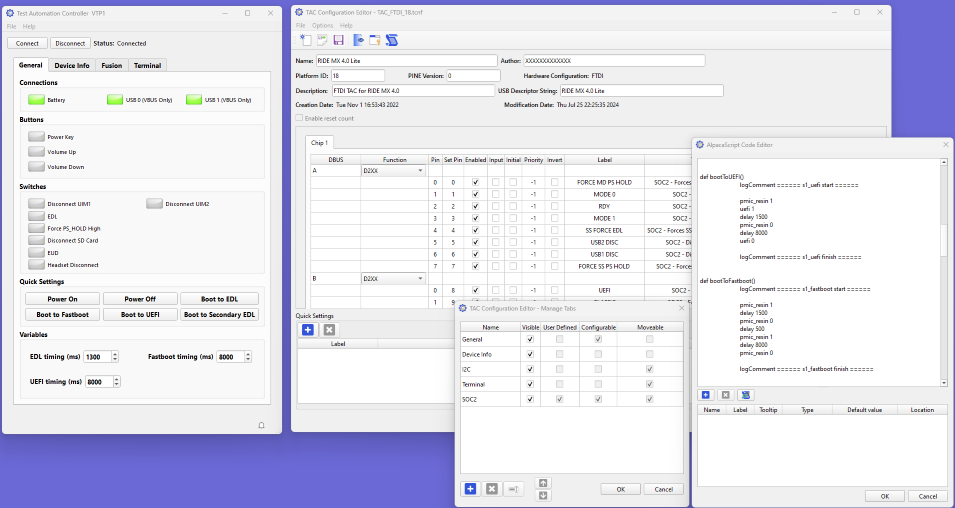
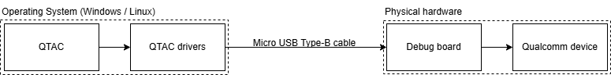
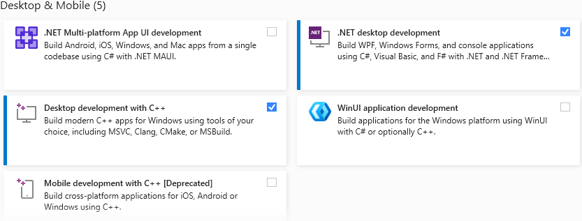
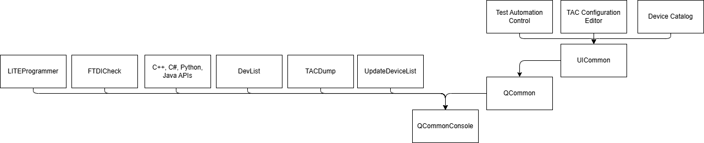

# Qualcomm Test Automation Controller (QTAC)

[](https://github.com/qualcomm/qcom-test-automation-controller/actions/workflows/build.yml)

## Table of Contents
- [Introduction](#introduction)
- [What You Get](#what-you-get)
- [Hardware Requirements](#hardware-requirements)
- [Common Prerequisites](#common-prerequisites)
- [Windows Guide](#windows-guide)
- [Linux Guide](#linux-guide)
- [macOS Guide](#macos-guide)
- [Repository Structure](#repository-structure)
- [Application Dependency Architecture](#application-dependency-architecture)
- [Advanced Topics](#advanced-topics)
- [Support & Contributing](#support--contributing)

## Introduction

QTAC is a software suite that enables users to control Qualcomm devices remotely via a Qualcomm approved debug board connected to a host.

## What You Get

| Application | Description |
| :--- | :--- |
| **Test Automation Controller (TAC)** | Control Qualcomm devices remotely using UI |
| **TAC Configuration Editor** | Design configurable TAC UI based on GPIO use-cases |
| **Device Catalog** | Program debug board and view supported Qualcomm platforms |
| **Command-line utilities** | DevList, FTDICheck, LITEProgrammer, PSOCProgrammer, TACDump, UpdateDeviceList |



## Hardware Requirements

**Required Hardware**:
- Qualcomm approved debug board (FTDI, Cypress PSoC5LP or Microchip PIC32CX SG41-based)
- Qualcomm device to be controlled
- USB Cables: Type B Micro-USB (Board to Host) & Type-C (Device to Host)

**Setup**: Connect the device to the debug board (directly or via cable strip) and both to the host.

> [!IMPORTANT]
> PSOC debug boards must be factory-programmed with firmware. If the board isn't recognized, it likely lacks programming.



## Common Prerequisites

### Development Tools

| Category | Software | Minimum Version |
| :-- | :-- | :-- |
| **OS** | Windows / Debian | Windows 10+ / Ubuntu 22.04+ |
| **Compiler** | [MSVC 2022](https://aka.ms/vs/17/release/vs_community.exe) / GCC | MSVC 2022 / GCC-11, G++-11, GLIBC-2.35 |
| **UI Framework** | [Qt Open-source](https://www.qt.io/download-qt-installer-oss) | 6.9.0+ |

> [!NOTE]
> Review license terms for [Visual Studio](https://visualstudio.microsoft.com/license-terms/) and [Qt](https://www.qt.io/development/download-open-source). MSVC 2022 is linked as Qt doesn't support MSVC 2026 yet.

### Drivers

- **[FTDI D2XX drivers](https://ftdichip.com/drivers/d2xx-drivers/)**: For debug board interaction.
- **[Qualcomm USB Drivers](https://softwarecenter.qualcomm.com/catalog/item/Qualcomm_Userspace_Driver)**: To view device status.

> [!NOTE]
> FTDI libraries are installed _automatically_ during the cmake configuration step when building from source.

### Optional Software

QTAC allows you to view streaming device logs as you transition the device between different states. The debug logs are streamed over USB serial interface(s).

To view these logs, you may install [Putty](https://www.putty.org/) or similar terminal software. QTAC does not depend on or use this software.

### Clone Repository

```bash
git clone https://github.com/qualcomm/qcom-test-automation-controller.git
```

## Windows Guide

### Configuration

1. **Git**: Install [Git for Windows](https://git-scm.com/download/win).

2. **Visual Studio 2022**: Install the
   [Community](https://aka.ms/vs/17/release/vs_community.exe),
   Professional, or Enterprise edition and select the following workloads:
   - **Desktop development with C++** (required — provides MSVC compiler, CMake, and Ninja)
   - **.NET desktop development** (required for C# interop builds)

   

   > [!NOTE]
   > CMake 3.16+ and Ninja are bundled with Visual Studio; no separate installation needed.

3. **Qt 6.8+**: Use the [Qt Online Installer](https://www.qt.io/download-qt-installer-oss)
   and select the following for the **MSVC 2022 64-bit** target:
   - Qt 6.8.x → **MSVC 2022 64-bit** (compiler binaries)
   - Qt 6.8.x → **Qt Serial Port**
   - Qt 6.8.x → **Qt Multimedia**

   > [!NOTE]
   > Installation using Qt Online Installer requires a Qt account.

4. **Environment Variable** — set `QTBIN` permanently in your user environment:
   ```cmd
   setx QTBIN C:\Qt\<version>\msvc2022_64\bin
   ```
   Open a new command prompt after running `setx` for the change to take effect.

### Build & Usage

Execute `build.bat` to generate executables:

```cmd
build.bat
```

**Build options**:
| Flag | Description |
| :-- | :-- |
| `--pristine` | Delete `build\`, `__Builds\`, and cached downloads before building (default) |
| `--incremental` | Reuse existing build tree and downloaded libraries |
| `--no-gui` | Build only headless libraries (`QCommonConsole`, `TACDev`) without Qt GUI modules or applications |
| `--debug` | Also build a Debug configuration (Release is always built) |
| `--install` | Install binaries, libraries, headers, and configs to `CMAKE_INSTALL_PREFIX` (default: `C:\Program Files\QTAC`); requires Administrator |
| `--deploy` | Run `windeployqt` to bundle Qt DLLs into each app directory (slow; use for distribution packages) |

**Build output**:
- Debug (with `--debug`): `__Builds\x64\Debug`
- Release: `__Builds\x64\Release`

**Usage**:
```cmd
__Builds\x64\Release\QTAC.exe
```

## Linux Guide

### Configuration

> [!IMPORTANT]
> - Installation using Qt Online Installer will require users to create a Qt account.
> - If you're frequently working with Qt on Linux, consider adding the environment variables to `.bashrc`.

1. **Build Tools**:
   ```bash
   sudo apt install cmake build-essential ninja-build git
   ```
   - `cmake` 3.16 or later
   - `build-essential` — GCC/G++ 11 or later and make
   - `ninja-build` — faster parallel builds (recommended)

2. **Qt 6.8+** (choose one):

   **Option A**: System Qt via apt (Ubuntu 24.04+ / Debian 13+)
   ```bash
   sudo apt install qt6-base-dev qt6-multimedia-dev qt6-serialport-dev qt6-tools-dev
   ```
   > [!NOTE]
   > Ubuntu 22.04 ships Qt 6.2 which is too old. Use Option B or C on 22.04.

   For `--no-gui` builds only `QCommonConsole` and `TACDev` are compiled, so fewer Qt
   packages are needed:
   ```bash
   sudo apt install qt6-base-dev qt6-serialport-dev qt6-tools-dev
   ```

   **Option B**: Qt Online Installer (any distro / Ubuntu version)
   - Install Qt 6.8+ for **GCC 64-bit**, selecting the **Qt Serial Port** and
     **Qt Multimedia** components using the
     [Qt Online Installer](https://www.qt.io/download-qt-installer-oss)

   **Option C**: aqtinstall (scriptable, no Qt account required)
   ```bash
   pip install aqtinstall
   aqt install-qt linux desktop 6.8.0 gcc_64 -m qtserialport qtmultimedia
   ```

3. **USB Access** — install the udev rule so the debug board is accessible without root:
   ```bash
   sudo cp udev-rules/99-QTAC-USB.rules /etc/udev/rules.d/
   sudo udevadm control --reload
   sudo udevadm trigger
   ```

4. **Environment Variable** — set `QTBIN` to the Qt `bin/` directory:

   System Qt (apt):
   ```bash
   export QTBIN=/usr/lib/qt6/bin
   ```
   Qt Online Installer or aqtinstall:
   ```bash
   export QTBIN=~/Qt/6.8.0/gcc_64/bin
   ```

### Build & Usage

Execute `build.sh` to generate executables:

```bash
./build.sh
```

**Build options**:
| Flag | Description |
| :-- | :-- |
| `--pristine` | Delete `build/`, `__Builds/`, and cached downloads before building (default) |
| `--incremental` | Reuse the existing build tree; skip the clean step. |
| `--no-gui` | Build only headless libraries (`QCommonConsole`, `TACDev`) without Qt GUI modules or applications; omits Qt Multimedia, Widgets, `qcommon`, `ui-common`, and all GUI apps |
| `--debug` | Also build a Debug configuration (Release is always built). |
| `--install` | Install binaries, libraries, headers, and configs to `CMAKE_INSTALL_PREFIX` (default: `/usr/local`); invokes `sudo cmake --install` |
| `--deploy` | Run `macdeployqt` to bundle Qt frameworks into each app bundle (slow; use for distribution packages; macOS only) |

**No-GUI build** — omits Qt Multimedia, Qt Widgets, `qcommon`, `ui-common`, and all GUI
applications. Only `QCommonConsole` and `TACDev` are compiled:

```bash
./build.sh --no-gui
```

**Build output**:
- Release: `__Builds/Linux-<distro>/Release`
- Debug (with `--debug`): `__Builds/Linux-<distro>/Debug`

**Usage**:
```bash
./__Builds/Linux-$(. /etc/os-release && echo "$ID")/Release/bin/TAC
```

## macOS Guide

### Configuration

1. **Xcode Command Line Tools**:
   ```bash
   xcode-select --install
   ```

2. **CMake 3.16+** (choose one):
   - Download from [cmake.org](https://cmake.org/download/)
   - Or install via Homebrew: `brew install cmake`

3. **Qt 6.8+** (choose one):

   **Option A**: Homebrew (simplest — includes all required modules)
   ```bash
   brew install qt
   ```

   **Option B**: Qt Online Installer
   - Use the [Qt Online Installer](https://www.qt.io/download-qt-installer-oss) and select
     the following for the **macOS** target:
     - Qt 6.8.x → **macOS** (compiler binaries)
     - Qt 6.8.x → **Qt Serial Port**
     - Qt 6.8.x → **Qt Multimedia**

   > [!NOTE]
   > Installation using Qt Online Installer requires a Qt account.

4. **Environment Variable** — set `QTBIN` to the Qt `bin/` directory:

   Homebrew:
   ```bash
   export QTBIN=$(brew --prefix qt)/bin
   ```
   Qt Online Installer:
   ```bash
   export QTBIN=~/Qt/6.8.0/macos/bin
   ```

### Build & Usage

`build.sh` is used on macOS with the same flags as Linux. FTDI D2XX is downloaded
automatically from an FTDI-provided DMG at cmake configure time (requires `hdiutil`,
which is built into macOS).

```bash
./build.sh
```

**Build output**:
- Release: `__Builds/macOS/Release`
- Debug (with `--debug`): `__Builds/macOS/Debug`

**Usage**:
```bash
open __Builds/macOS/Release/bin/TAC.app
```

## Repository Structure

| Directory | Content |
| :-- | :-- |
| `.github` | CI/CD build pipelines |
| `configurations` | Platform-specific pin configurations |
| `docs` | Documentation and guides |
| `examples` | Device-control automation scripts |
| `interfaces` | APIs for C++, Python, C#, and Java |
| `src` | Source files (Applications & Libraries) |
| `third-party` | External dependency scripts |

## Application Dependency Architecture



## Advanced Topics

- [Build Using Qt Creator](./docs/getting-started/01-Build-Using-Qt-Creator.md)
- [Python API Guide](./docs/bootcamp/01-Bootcamp.md)

## Support & Contributing

- **Security**: Review [SECURITY.md](./.github/SECURITY.md) for vulnerability reporting.
- **Contributing**: Review [License](./LICENSE) and [Code of Conduct](./CODE-OF-CONDUCT.md).
