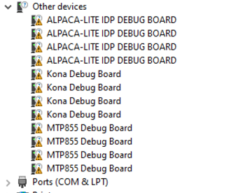

# Bootcamp Reference

This guide will help you quickly get started with development using the **QTAC**
Python libraries provided by QTAC as part of QTAC installation.

## Prerequisites

You must have **Python 3** installed in the environment with version greater
or equal to **3.8.0**.

## Installing the libraries

After you have installed the QTAC software suite from the QPM, please navigate
to the below path depending on the OS, you've installed.

- Linux: `/opt/qcom/QTAC/python/`
- Windows: `C:\ProgramData\Qualcomm\Alpaca\Python\XPlatform`

Execute the `setup.sh` if the OS is Linux and `setup.bat` if the OS is Windows.

> Sample example scripts are available at: `C:\QTAC\Examples`

🔴 **Please use the API provided under the `XPlatform` sub-directory.

## Testing the setup

Add the below statements to a python file and execute the python script:

```python
# Import the QTAC TACDev library
import TACDev

# Get the count of TAC devices
device_count = TACDev.GetDeviceCount()

# If the device count is 0, print a message and exit
if device_count == 0:
    print("Found 0 TAC device")
    exit(0)

# Print the serial number and port name for every TAC device
for idx in range(device_count):
    tac_device = TACDev.GetDevice(idx)
    print(f"Found device with serial number: {tac_device.SerialNumber()} and port name: {tac_device.PortName()}")
```

If the above script executed properly, this means you have installed the
libraries properly.

## Troubleshooting

**Q. Why do I receive the `ModuleNotFoundError` when I try to import TACDev or EPMDev?**

A. Please follow the [installing the libraries](#installing-the-libraries) section
and install the python packages.

**Q. I received the below error message while importing the libraries. Why?**

_Could not find module 'C:\Program Files (x86)\Qualcomm\QTAC\TACDev.dll' 
(or one of its dependencies). Try using the full path with constructor syntax._

A. You are possibly trying to import the library after uninstalling the QTAC
tool. Please reinstall QTAC from QPM and import the library.

**Q. Why does `TACDev.GetDeviceCount()` returns 0 devices?**

A. Please check whether you've properly connected the debug board to your setup.

If you're sure about the connectivity, check if you have an **Unknown Device**
in the **Device Manager** on Windows.

Try manually running FTDI installer present at `C:\ProgramData\Qualcomm\QTAC
\FTDI`. If you're using Linux, you're not required to configure drivers manually.

**Q. `TACDev.GetDeviceCount()` does not return the expected device count. Why?**

A. Please check if you have exhausted the serial port connections using the
**Device Manager** on Windows. Sample scenario in the image below.


