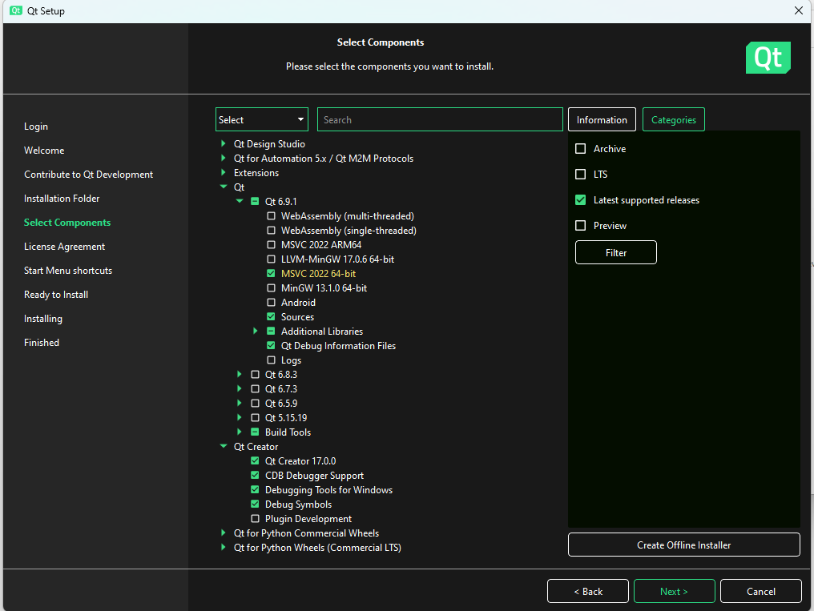
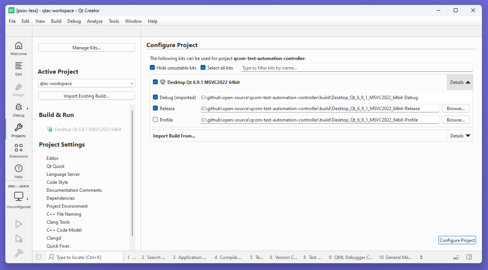

# Build QTAC using Qt Creator

The [README](../../README.md) outlines the steps required to build QTAC using command line interface.
To understand and modify the Qt UI components, you will need to get Qt Creator. If you've already
installed Qt, you may execute the **Qt Maintainence Tool** to download the additional software Qt
Creator. If you're performing a fresh install, use the [Qt Online Installer](https://www.qt.io/download-open-source).

## Configure Qt installation
QTAC requires Qt6 and MSVC2022 64-bit. Please review below custom install configuration in Qt to optimize download time.

Required additional libraries:
1. Qt Serial Bus
2. Qt Serial Port



## Clone repository
Use the below command to clone the project source:
```bash
git clone https://github.com/qualcomm/qcom-test-automation-controller.git
```

## Configure Qt 6.9.0
Open the session. The **Project** tab on the left pane will be inactive. Create a
[Sample Qt project](https://doc.qt.io/qtcreator/creator-project-creating.html) to see if Qt is set up properly.

The **Project** tab now becomes active. Review the Qt kit configuration. Make sure no stray paths or kits are present
as they can lead to erroneous libraries and applications.

The numbers on the image refers to some of the areas you need to review before building the project.


## Setup third-party libraries
QTAC uses FTDI libraries to control FT4232H chip on the debug board. You can find out more about the FTDI D2XX libraries
[here](https://ftdichip.com/drivers/d2xx-drivers/). The CMake scripts take care of setting up the libraries and no manual step is required. 

## Open project
Now you're set to build the project using Qt Creator.

Open the [CMakeLists.txt](../../CMakeLists.txt) inside Qt Creator. This sets up the project structure for you in the editor.
You do not need to manually configure Qt dependencies or open sub-projects.


## Load project


## Configure project


## Build project
Right-click on the project you wish to build, debug, run to compile, debug and execute respectively.


## Further reading
To learn more about Qt, please refer the following links:
1. Qt installation: https://doc.qt.io/qt-6/qt-online-installation.html
2. Qt Creator: https://doc.qt.io/qtcreator/index.html
