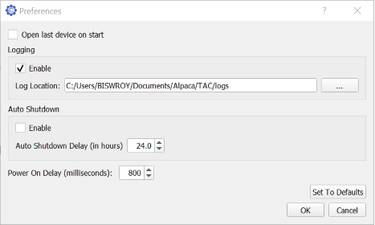

# Test Automation Controller

## Introduction

The Test Automation Controller (TAC) provides an interface for talking to a debug
board.  The UI provides a point and click mode of operation, and the application
provides a COM interface for driving the application from other programs and scripts. 

📝 Please note that a debug board will function without any device attached. The user asks the TAC to carry out a function using the actions in the TAC UI or methods in the TAC API. The TAC then asks the debug board to carry out the function.  The debug board turns GPIO lines on and off in response to these requests. 

All the debug board can do is respond, "ok", I turned that line on or off. The debug board doesn't know if a device is attached and responding. It doesn't get any feed back from the device as to what device is attached. 

_There have been suggestions to various hacks to possibly do board identification.  The hacks are problematic due to the inconsistencies introduced by the hardware teams._

**Buttons** are a virtual representation of the physical buttons on the device.
Holding down the physical buttons will cause the phone to boot to different modes.

**Switches** act as boot up modifiers. They act on various phone features to enable or
disable them.  In this example, you can see that two of the switch labels are grayed
out.  This indicates that these functions are not available on this debug board.

**Quick Settings** act as a timed sequence to carry out an operation. The button assert
time is how long a modifier button is held down. For example, bootToFastBoot, uses the
volume down during start up to indicate a fast boot startup.

## The preferences window

The TAC UI can be configured according to preference using this window. Navigate to File > Preferences to access the Preferences dialog.

As a first step to understand any problem with TAC, you may enable logging here and select OK.

You will find the TAC logs available at the configured log location.

## Troubleshooting

**Q. My debug board is not being detected by TAC UI?**

A. Please read the article on [endpoint exhaustion](./06-Troubleshooting.html#endpoint-exhaustion) and understand if you are facing a similar situation. A sample image is available here: [troubleshooting](../bootcamp/01-Bootcamp.html#troubleshooting)

**Q. Some of the buttons on the debug board does not execute the desired function. What should I do?**

A. QTAC is configured to use standard configurations for all the supported debug board. Please test with a different debug board in this case. It is possible for a debug board to be wired incorrectly.

**Q. I have a custom script that does not use QTAC APIs to perform TAC operations and it stopped working.**

A. Use the standard QTAC APIs and the QTAC UI to execute TAC commands. If you are using any custom scripts, it will be difficult for us to provide support or fix them.

**Q. The device info tab shows "Firmware too old" message. How can I update to a new one?**

A. QTAC comes with a command line program called `FWUpdate` and the latest firmware at `C:\ProgramData\Qualcomm\QTAC\firmware`. Choose the relevant firmware according to the debug board chipset (eg. LP030). Execute the FWUpdate command with the firmware's `.cyacd` file while keeping your debug board connected to update the firmware of the debug board.
