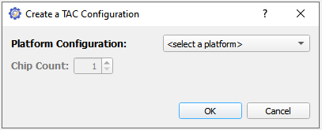
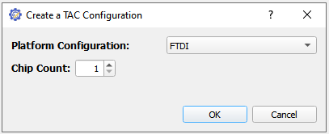
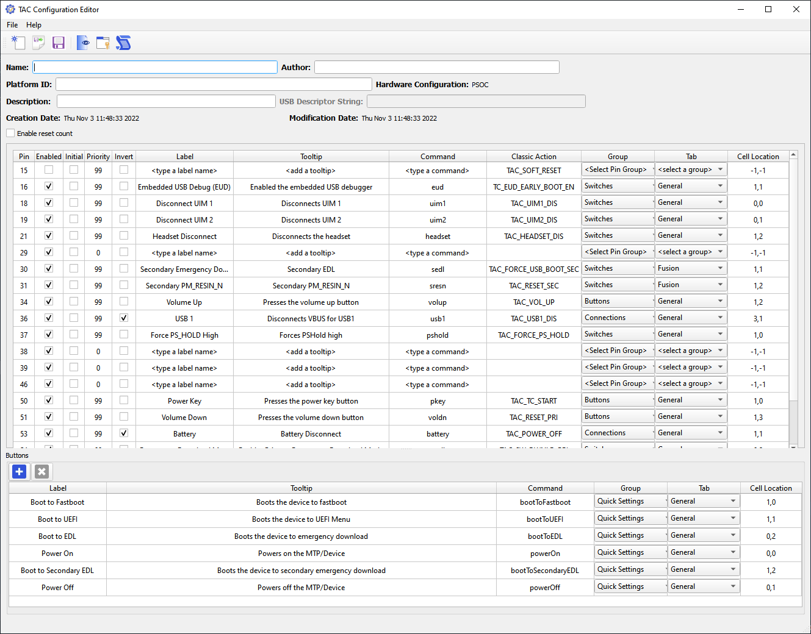
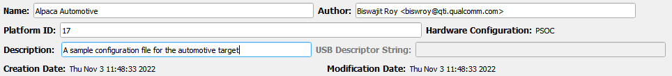
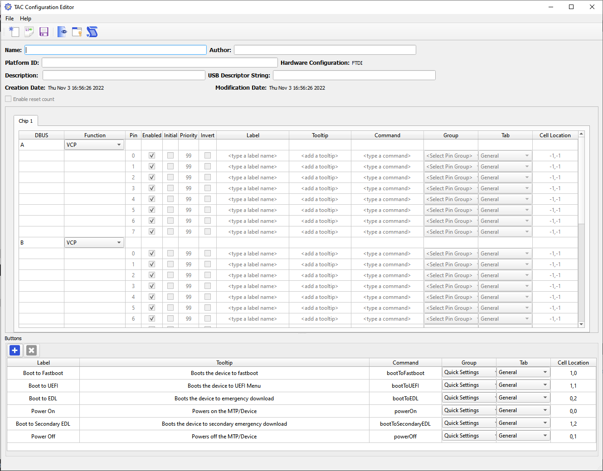
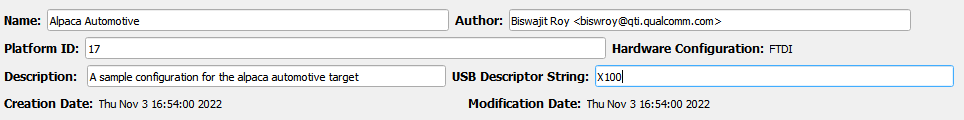
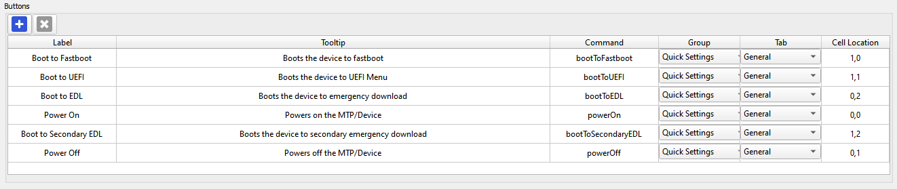
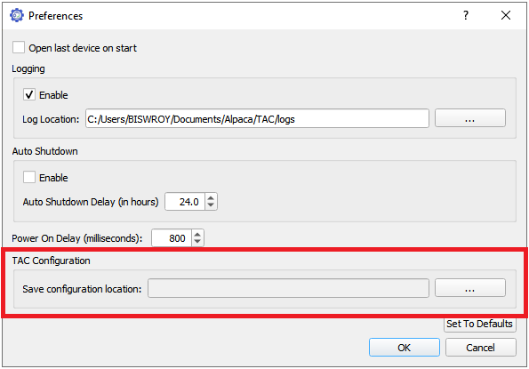
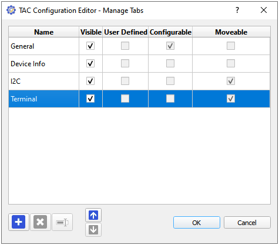
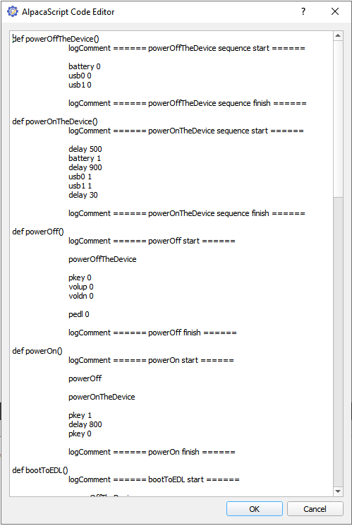

# TAC Configuration Editor

## Introduction

TAC Configuration Editor (TCE) allows you to generate `.tcnf` files which can be used to generate
dynamic TAC UI for different debug board configurations.

## Understanding the editor layout

Most major operations that can be performed on a chip can be found in the TCE toolbar.
The menu bar contains some of the important operations to use the TAC Configuration Editor.

An inactive operation is denoted by a grey icon while active operations are always coloured.

## Create New Configuration

Go to File and select 'New Configuration' or click on the New Configuration icon 📄 on the
toolbar or simply press `Ctrl+N`. A new configuration dialogue box will appear as seen below.

TAC Configuration Editor lets you write configuration for 2 different debug board types:
- PSOC
- FTDI

> _The GoWin platform will be available in future QTAC releases_

The Chip count button is disabled when the `PSOC` platform configuration is selected because we
do not have debug boards with multiple PSOC chips. When you select the `FTDI` platform configuration,
the chip count dialogue box is activated. You can enter the number of FTDI chips, you're programming for.

> <mark>_You can program for a maximum of 4 FTDI chips for a platform. Hence, the maximum chip count is **4**._</mark>

## The PSOC Configuration

As soon as you click on 'OK' in the dialogue box, the selected PSOC configuration table appears.
You will also find the toolbar buttons like [Preview Configuration](#the-preview-configuration),
[Manage tabs](#the-manage-tabs) and [Open Script Editor](#the-script-editor) gets activated.

Your TAC Configuration Editor will look as below:

You will also notice that fields like Name, author, platform id, and description are enabled for PSOC.

Below is a sample image with the input fields filled appropriately. You may also hover over the input fields
to understand what to do by going through the tooltip when they appear.

**The Platform ID is a required field if you wish to save the configuration file**.
The hardware configuration, creation date and modification date are filled automatically and cannot
be modified from the TAC Configuration Editor. The USB descriptor string is not required for PSOC
chips and is hence disabled.

Some of the values in the PSOC table are pre-filled to help you modify only the required fields but it is
advised to verify all the rows for improper configurations. 

## The FTDI Configuration

As soon as you click on 'OK' in the dialogue box, the selected FTDI configuration table appears.
You will also find the toolbar buttons like [Preview Configuration](#the-preview-configuration),
[Manage tabs](#the-manage-tabs) and [Open Script Editor](#the-script-editor) gets activated.

Your TAC Configuration Editor will look as below:

You will also notice that fields like Name, author, platform id, and description, usb descriptor
string are enabled for FTDI.

Below is a sample image with the input fields filled appropriately. You may also hover over the input fields
to understand what to do by going through the tooltip when they appear.

The Buses 'A' and 'B' are disabled by default. These buses can be enabled by selecting **D2XX** under
the function column. The FTDI table is filled with default values for Buses 'C' and 'D' for ease.
Please verify the default values and update them manually if necessary.

## The Buttons Table

Whether you select the PSOC, FTDI or any other platform configuration, you will always find the
buttons table in the TAC Configuration Editor window. This table lets you configure the buttons
under the **Quick Settings** group. You can add and remove any button by using the ➕ and ❌
button. The command column contains the custom command name as defined in the AlpacaScript.

Alternatively, **updating the cell location to -1,-1 also hides the button in the preview**.

Below is a preview of the buttons table:

## Saving TAC Configuration

The default save location for the TAC Configuration is `C:\Users\<user-name>\Documents\QTAC\TAC Configurations`.
You can save your work at any point using the 💾 icon in the toolbar.

A platform id is mandatory to be able to save your file. This ensures the platform you're building the configuration for.
The filename of the saved file will be of the format **TAC_[PLATFORM-TYPE]_[PLATFORM-ID].tcnf**. 

In case, you wish to modify the default save location for the TAC Configurations, open the QTAC Test Controller.
From the File menu, select Preferences. From the preferences window, update the save location path.

## Open a TAC Configuration

You can open a TAC Configuration Editor File by selecting **Open Configuration...** from the File menu. 

You will also be able to open an existing file and make changes to it and save it under a different platform id.
The platform type for such updates should be however same.

## The Preview Configuration

The preview icon in the toolbar lets you visualize a TAC Configuration File. To see a preview of your configuration, you
may press `Ctrl+P` or select **Preview Configuration...** from the File menu or click on the preview icon on the toolbar.

<mark>You will only be able to use the preview mode when you are in a valid hardware configuration.</mark>

When you add a new tab, you will be able to see the new tab in the TAC Preview. To hide a button or pin LED from coming
to view in the TAC Preview UI, you may update the group and tab column's value to defaults.

## The Manage Tabs

The manage tabs dialog lets you add, remove, reorder and rename tabs for any valid hardware configuration.

Below is a preview of the manage tabs:

The 🔼 and 🔽 arrows can help move a selected tab up or down the tab order. The ➕ button lets you add a user-defined tab.
And the ❌ button lets you remove a user-defined tab. Tabs which are not user-defined cannot be removed. Some tabs like I2C
and the terminal tab can be moved to different tab location. To rename a tab, you need to click the rename button beside the
remove button.

## The Script Editor

The AlpacaScript editor lets you define custom behaviours for the quick settings buttons. You will be required to define the
behaviour of your custom button in the AlpacaScript window and map the custom command name in the [buttons table](#the-buttons-table).

Below is a preview of the script editor

To learn about how to write a custom AlpacaScript command, read the [AlpacaScript QuickStart](../bootcamp/03-Script-Editor.md) guide.
