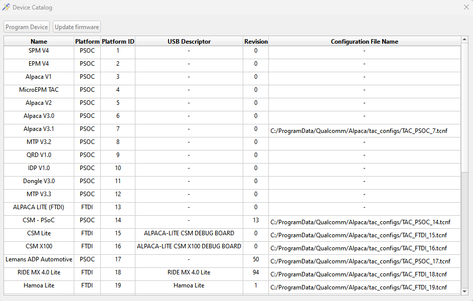
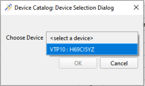
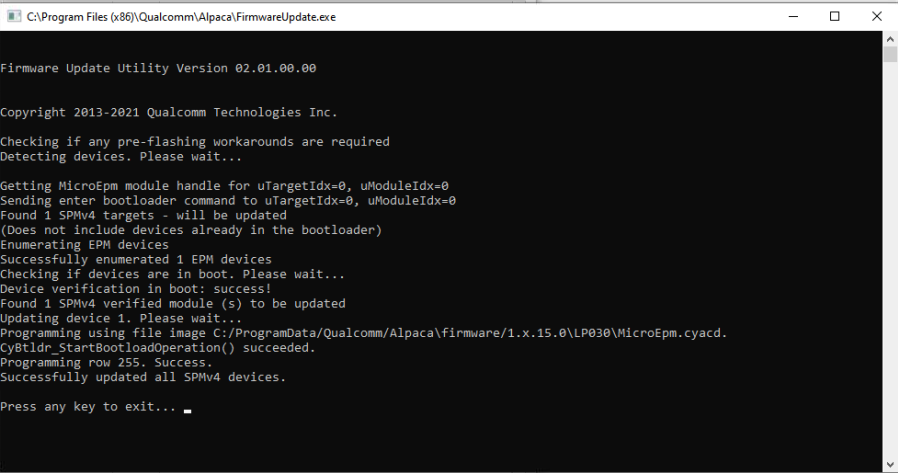

# Device Catalog

## Introduction

Device Catalog provides list of all supported platforms in QTAC with their TAC configuration. QTAC TAC also works with unsupported platforms using a default configuration. The default configuration is tailored for Kailua targets and has historically worked as expected for most unsupported platforms.

> If you find unexpected behaviour with the configuration in use, you can inform about the behaviour to QTAC support with a screenshot of the 'Device Info' tab from the TAC UI.

## Open a TAC Configuration

To open a platform configuration, click on the file path under the `Configuration File Name` column for the platform. Some platforms do not have configurations (represented by `-`) and are supported using the default configuration.

## Program the debug board

Select the row by clicking on the platform. If you selected a platform of PSOC platform type, both `Program Device` and `Update firmware` buttons will get activated. If you selected a platform of FTDI platform type, only the `Program Device` button will get activated. To program the device, click on Program Device button and choose the PSOC device you wish to program. The device you're programming must be connected to the host machine.

The FTDI debug board does not have firmware so firmware programming is not required.

## Update the debug board firmware (PSOC only)

Select a platform of PSOC platform type. The `Update firmware` button gets activated. Click on `Update firmware` to program the debug board.

## FAQ

**Q. I found the following error dialog when I try to connect to the TAC device using the QTAC TAC UI. What should I do?**

A. The dialog box describes the steps that need to be followed. Please try to perform these steps. For a more descriptive version, you may read the Firmware programming (PSOC Only) section of this page.

**Q. My automation failed with "OSError: exception: access violation reading 0x0000000000000000" when I used "tacDevice.Open()". Why?**

A. Make sure you're using the latest version of QTAC. Try to update the firmware by following the Firmware programming (PSOC Only) documentation above.

**Q. I see Unknown Board ID: 0 as HW Version in the TAC UI's Device Info and the FWUpdate utility is unable to program the device?**

A. Program the debug board using the `Program Device` button from the Device Catalog tool and update the debug board firmware by clicking
on the `Update firmware` button in Device Catalog.
