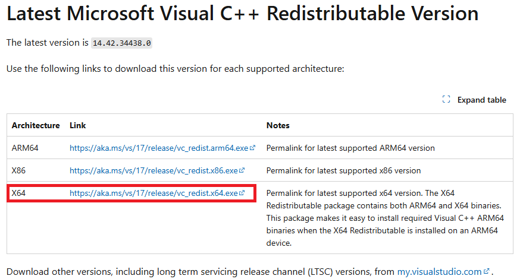
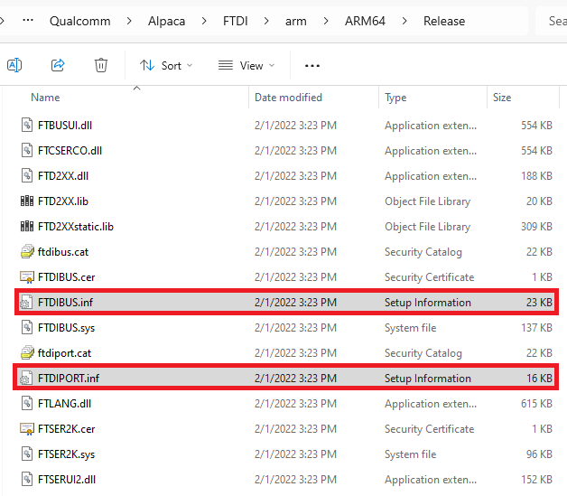

# QTAC on Windows ARM

## Introduction
QTAC on Windows ARM is a combination of software and circuitry which integrates debug, power measurement and
test automation capabilities into a single board. The device to be tested is connected to the host using a USB cable.

## Install using QPM
QTAC on Windows ARM can be downloaded using [Qualcomm Package Manager](https://qpm.qualcomm.com) or installed
using the qpm-cli by issuing the command `qpm-cli --install QTAC`.

For QPM to work on Windows ARM machines, please ensure [Microsoft Visual C++ Runtime Library (x64)](https://learn.microsoft.com/en-us/cpp/windows/latest-supported-vc-redist?view=msvc-170#visual-studio-2015-2017-2019-and-2022) is installed

## Manually install ARM drivers
On Windows ARM setups, please follow the below steps to install ARM drivers for QTAC
1. Go to `C:\ProgramData\Qualcomm\QTAC\FTDI\arm\ARM64\Release`
2. Right click on `FTDIBUS.inf` and click install
3. Right click on `FTDIPORT.inf` and click install

_You will now be able to see connected TAC devices in the QTAC TAC UI / API_
